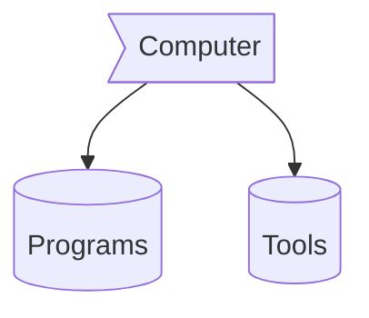

<h3 align="center">
  Welcome to kisaki's profile!
  
</h3>
<p align="center">
  <a href="[https://github.com/CodeWhiteWeb/CodeWhiteWeb](https://guns.lol/berserkerr)"></a>
</p>

---
<div align="center">
  


### Computer :> Programs && Tools



-  **Vscode** not for web it for everything
-  Chromium base web browser like **Firefox** 
-  <a href="https://getpaint.net">**Gimp**</a> for image manipulation
-  linux I highly prefer Arch. but, sometimes you can rely on debiun. so, **PopsOs** by (System76)


## Technologies 

```mermaid
flowchart 
f1[HTML]
f2[Css]
f3[javaScpit]
f4[Markdown]
fw1((ReactJs))
fw2((NextJs))
fw3((Bootstrap))
fw4((tailwind))
fw5((Scss))
fw6((mermaid))
b1{NodeJs}
b2{RestAPIs}
b3{PHP}
 subgraph  BackEnd
b1
b2
b3
 end  
 subgraph Framworks 
fw1
fw2
fw3
fw4
fw5
fw6
 end
  subgraph  FrontEnd 
 f1
 f2
 f3
 f4
 end  
 f1 --o f2
 f1 --o f3
 f1 --o f4
 f2 --> fw3
 f2 --> fw4
 f2 --> fw5
 f3 --o fw1
 f3 --o fw2
 fw2 --o b1
 f4 --> fw6
 b1 --o b2
 ```


### ✍️Random Dev Quote


---


---

</div>
